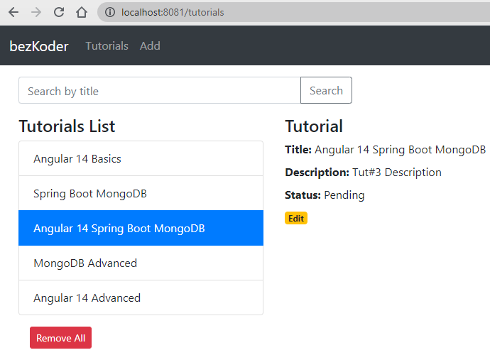

[](https://classroom.github.com/a/k4PnYz5w)
# Kubernetes PE: CI/CD met de SBAMTut app


## Punten
De PE staat op 20 punten.

## Opdracht: minimum requirements (10 punten)

- Deze oplossing moet testbaar zijn vanop een andere machine dmv deze repo.
- Documentatie is good practice en verplicht voor manuele handelingen zoals het starten van scripts.
- IaC overal - er zijn 2 scripts in de Oplossingen directory: deploy_test en deploy_prod die zo weinig mogelijk instructies bevatten (idealiter niet meer dan 2 instructies)
  - dit kan evt ook 1 scriptje zijn met een volledige gitops-based set-up.
- andere extra files staan allemaal in de Oplossingen directory, met eventuele uitzondering voor Dockerfiles.

### Container image
Maak automatisch container images aan als een github package bij creatie van een nieuwe github tag.

- Gebruik hiervoor github actions en een private github action runner bij een cloudprovider (AWS, Google, Azure, Oracle, of DigitalOcean). Je mag dit manueel opzetten.

- Het release label wordt gebruikt als basis voor de image tag
  - TEST labels beginnen met TEST_
    bv TEST_v0.8
  - QA labels beginnen met QA_
    bv QA_v0.8
  - PROD labels beginnen met PROD_
    bv PROD_v1.0
  - automatische deployment van enkel de juiste environment in de cluster wanneer je een github label zet.

- Bijvoorbeeld:
  - De github repo wordt manueel getagd met bv. TEST_v0.8
    - Er worden automatisch images gebouwd van de frontend en de backend
    - De images worden automatisch gepublished als package met <image_naam>:TEST_v0.8
    - Er is wschlk. een manuele actie nodig van een gebruiker die bv een versienummer of tag in een file aanpast (bv. de kustomize yaml) in github en incheckt
    - Deze nieuwe versie heeft helaas het nieuwe label niet, maar dat laten we even zo
    - Argocd TEST environment pikt de nieuwe kustomize changes en dus nieuwe images op en deployet de nieuwe versies
  - De github repo wordt manueel getagd met bv. PROD_v1.0
    - Er worden automatisch images gebouwd van de frontend en de backend
    - De images worden automatisch gepublished als package met <image_naam>:PROD_v1.0
    - Er is een manuele actie nodig van een gebruiker die een versienummer in een file aanpast (bv. de kustomize yaml) in github en incheckt
    - Deze nieuwe versie heeft helaas het nieuwe label niet, maar dat laten we even zo
    - Argocd PROD environment pikt de nieuwe kustomize changes en dus nieuwe images op en deployet de nieuwe versies

### Kustomize

Gebruik kustomize en definieer dmv overlays 3 environments: TEST, QA en PROD

- TEST:
  - frontend app: 1 pod instance
  - spring boot server: 1 pod instance
  - mongodb: 1 pod instance
  - resource limits: 1GB RAM per instance
- QA:
  - frontend app: 2 concurrent instances
  - spring boot server: 2 concurrent instances
  - mongodb: 2 concurrent instances
  - resource limits: 1.5GB RAM per instance
- PROD:
  - frontend app: 3 concurrent instances
  - spring boot server: 2 concurrent instances
  - mongodb: 3 concurrent instances
  - resource limits: 2GB RAM per instance

Note: de RAM resource limits mogen anders zijn dan hierboven beschreven, voor de mensen met limited RAM, zolang de 3 environments verschillende ram resource limits hebben.

### Deployment

- Maak 2 environments met elk een kubernetes cluster: TEST en PROD.
- Deploy met `argocd` de juiste environment op de kubernetes clusters TEST en PROD
  - de applicatie wordt gedeployed met `kustomize`
  - de applicatie draait in eigen namespace `testsbamtut` voor TEST en `prodsbamtut` voor PROD
  - gebruik een Ingress om de applicatie te accessen
  - de applicatie is reachable via poort 9999
  - *de applicatie werkt!*
- Alles blijft binnen deze repo. (geen extra repo's / environment hoewel dat eigenlijk aangeraden is)

## Extra punten
Enkel mogelijk  wanneer de minimum requirements zijn voldaan.

### Extra 1 (1 punt)

Automatische deployment van enkel de juiste environment in de cluster wanneer je een github label zet zonder andere manuele, extra stappen.

- De github repo wordt manueel getagd met bv. TEST_v0.8
  - Er worden automatisch images gebouwd van de frontend en de backend
  - De images worden automatisch gepublished als package met <image_naam>:TEST_v0.8
  - (Mogelijke automatische actie: kustomize file(s) ‘automagically’ aangepast en ingecheckt)
  - Argocd TEST environment pikt de nieuwe kustomize changes en dus nieuwe images op en deployet de nieuwe versies
- De github repo wordt manueel getagd met bv. PROD_v1.0
  - Er worden automatisch images gebouwd van de frontend en de backend
  - De images worden automatisch gepublished als package met <image_naam>:PROD_v1.0
  - (Mogelijke automatische actie: kustomize file(s) ‘automagically’ aangepast en ingecheckt)
  - Argocd PROD environment pikt de nieuwe kustomize changes en dus nieuwe images op en deployet de nieuwe versies

### Extra 2 (2 punten)
- Alles wordt gedeployed/beheerd dmv GitOps.
- Argocd wordt declarative opgezet en volledig geconfigureerd dmv IaC, ipv verschillende commando's in een script.

### Extra 3 (1 punt)

Gebruik Terraform om je private EC2 github action runner op te zetten bij een cloudprovider (AWS, Google, Azure, Oracle, of DigitalOcean).

### Extra 4 (3 punten)

- Naast een werkende kustomize oplossing gebruik je ook nog eens helm chart(s) voor de deployments naar de namespaces `testsbamtuth` voor TEST en `prodsbamtuth` voor PROD.
- Automatische deployment van enkel de juiste environment in de cluster wanneer je een github label zet zonder andere manuele, extra stappen.
- Praktisch: 2 extra clusters (je kan de andere 2 eventueel afzetten na demo), of hergebruik van de clusters maar dan mag je met de hand de kustomize deployments even af zetten en de helm deployments aanzetten.

### Extra 5 (3 punten)

Gebruik Terraform om bovenstaande cluster set-up bij een cloud provider op te zetten (AWS, Google, Azure, Oracle, of DigitalOcean).

## Application: Spring Boot Angular MongoDB Tutorial App

An app to manage tutorials.

Full-stack Angular 14 + Spring Boot + MongoDB - Tutorial CRUD Application:
- Each Tutorial has id, title, description, published status.
- We can create, retrieve, update, delete Tutorials.
- We can also find Tutorials by title.



For instructions, please visit:
> [Spring Boot + Angular 14 + MongoDB CRUD example](https://www.bezkoder.com/spring-boot-angular-14-mongodb/)

### Run Spring Boot application
```
cd spring-boot-server
mvn spring-boot:run
```
The Spring Boot Server will export API at port `8081`.

### Run Angular Client
```
cd angular-14-client
npm install
ng serve --port 8081
```

# Belangrijk
- Plagiaat is niet toegestaan. (zie PXL examenregelement)
- Hier staan strenge straffen op, tot zelfs uitsluiting van alle examens.
- De persoon die eventuele oplossingen doorgeeft is eveneens schuldig aan plagiaat.
- Er wordt enkel individueel gewerkt.
- Op regelmatige tijdstippen wordt er gecommit naar github (minstens 1x per elk 1 uur werk). Het falen van deze verplichting heeft een '0' tot gevolg.
- Er wordt NIET gecommuniceerd over de PE met andere studenten! Dat wordt beschouwd als plagiaat.