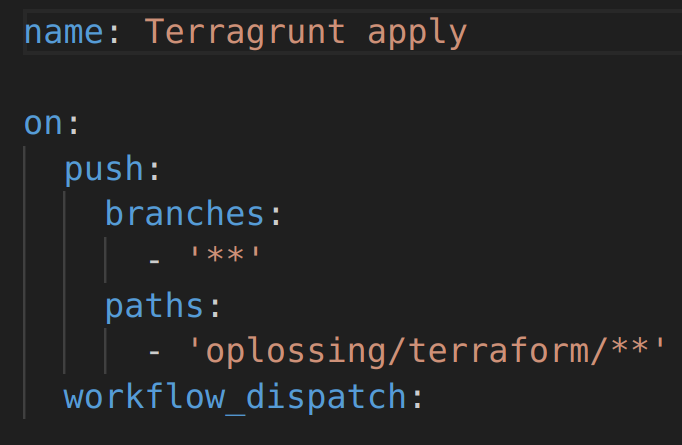

# Usage

To deploy this project, follow the steps below.

1. **Make sure the GitHub Actions secrets match your (desired) situation.**

- `ADMIN_PASSWORD`: The password for the ArgoCD admin user. This will be the password used to log in to ArgoCD.
- `AWS_ACCESS_KEY_ID`: The access key ID for your AWS account.
- `AWS_REGION`: The AWS region where resources will be deployed. Keep in mind that changing this will require you to modify the code as well. The default value is `us-east-1`.
- `AWS_SECRET_ACCESS_KEY`: The secret access key for your AWS account.
- `AWS_SESSION_TOKEN`: The session token for your AWS account.
- `DOCKERHUB_TOKEN`: The token for DockerHub.
- `DOCKERHUB_USERNAME`: The username for DockerHub.
- `GHCR_TOKEN`: The token for GitHub Container Registry.
- `GH_TOKEN`: The token for GitHub.
- `GH_USERNAME`: The username for GitHub.
- `HASHED_ADMIN_PASSWORD`: The bcrypt hashed password for the ArgoCD admin user.
- `RUNNER_TOKEN`: The token for the GitHub Actions runner.
- `SSH_PRIVATE_KEY`: A private SSH key.This key will be used by ArgoCD to sync with the GitHub repository.

Also make sure you've changed the bucket name in the `common_vars.yml` file, located beneath the `infrastructure-live` directory.

2. **Run the Terragrunt Apply GitHub Actions workflow.**

This can be done by clicking on the `Actions` tab, selecting the `Terragrunt Apply` workflow and clicking on the `Run workflow` button or by committing a change to the terraform code.

There is a chance that the first attempt will eventually will fail due to ArgoCD failing to create new session client. A simple re-run of the workflow should fix this.

3. **Create and push a GitHub tag**

Since the Angular client is dependent on the ingress load balancer's DNS name, the application won't work when the infrastructure changes. By creating and pushing a GitHub tag, the Angular client will be built and the DNS name will be updated. ArgoCD will pick up the changes automatically and deploy them. Keep in mind that the new version may not work directly in your browser due to the previous version being cached. Switching to incognito mode or clearing the cache should fix this.